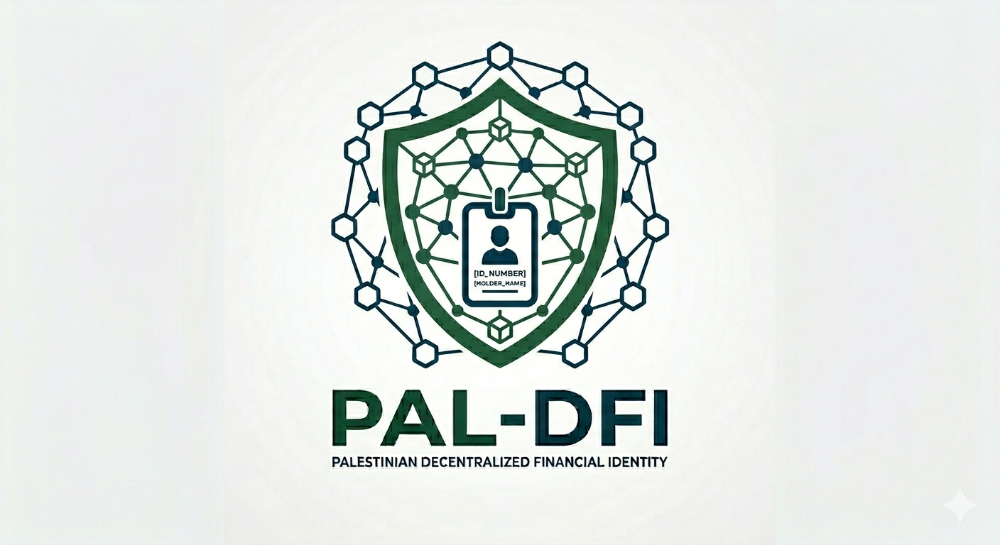

<p align="center">
  
</p>

<h1 align="center">PAL-DFI</h1>
<h3 align="center">Palestinian Decentralized Financial Identity</h3>

<p align="center">
  <b>Enterprise-Grade Consortium Blockchain Platform for Trusted Financial Identity Verification</b>
</p>

<p align="center">
  
  
  
  
  
  
  
</p>

---

# Executive Summary

**PAL-DFI (Palestinian Decentralized Financial Identity)** is a strategic enterprise-grade digital trust platform designed to modernize financial identity verification across Palestine’s institutional ecosystem.

The platform establishes a **permissioned consortium blockchain network** where regulated institutions collaboratively issue, verify, and govern trusted digital financial identity credentials.

Rather than relying on centralized verification databases and middleware trust assumptions, PAL-DFI distributes institutional trust using **Hyperledger Fabric**, enabling secure, auditable, tamper-resistant, and interoperable identity verification services.

---

# Strategic Vision

> **To establish the trusted decentralized financial identity backbone for Palestine’s digital financial ecosystem.**

PAL-DFI is intended to become foundational infrastructure supporting:

- Digital banking
- Financial inclusion
- Electronic KYC (eKYC)
- Credit onboarding
- FinTech trust services
- Telecom-assisted verification
- Regulated digital credentials
- Cross-institution identity interoperability

---

# Business Problem

Traditional identity verification architectures introduce serious limitations:

### Centralized Dependency
Verification depends entirely on a single authority or database.

### Single Point of Failure
System outages disrupt all verification workflows.

### Weak Auditability
Limited transparency into who verified what and when.

### Fraud Exposure
Tampering or unauthorized credential manipulation becomes possible.

### Institutional Fragmentation
Banks, regulators, telecoms, and government systems operate in silos.

### Slow Onboarding
Manual verification delays customer onboarding.

---

# PAL-DFI Solution

PAL-DFI replaces centralized trust with **institutional consortium trust**.

Trusted ecosystem participants collaboratively validate and issue digital financial identity credentials.

## Consortium Participants

### PMA
**Palestinian Monetary Authority**

Role:
- Financial governance
- Credential issuance
- Regulatory trust authority

---

### MOI
**Ministry of Interior**

Role:
- Citizen identity verification
- Civil registry authority
- Identity trust anchor

---

### JAWWAL
**Telecommunications Provider**

Role:
- Mobile ownership verification
- Telecom trust validation
- Alternative identity signal provider

---

### Banks / FinTech Platforms

Role:
- Credential consumers
- Verification requestors
- Financial service onboarding participants

---

# End-to-End Workflow

```text
┌──────────────────────────────────────────────┐
│              Citizen Registration            │
└──────────────────────────────────────────────┘
                      │
                      ▼
┌──────────────────────────────────────────────┐
│       MOI Civil Identity Verification        │
│  Validate National ID / Citizen Authenticity │
└──────────────────────────────────────────────┘
                      │
                      ▼
┌──────────────────────────────────────────────┐
│      JAWWAL Telecom Trust Validation         │
│  Verify Mobile Ownership / Subscriber Trust  │
└──────────────────────────────────────────────┘
                      │
                      ▼
┌──────────────────────────────────────────────┐
│      PMA Financial Eligibility Review        │
│    Financial Identity Credential Decision    │
└──────────────────────────────────────────────┘
                      │
                      ▼
┌──────────────────────────────────────────────┐
│      Smart Contract Credential Issuance      │
│         Hyperledger Fabric Chaincode         │
└──────────────────────────────────────────────┘
                      │
                      ▼
┌──────────────────────────────────────────────┐
│     Immutable Blockchain Credential Record   │
│           palidentitychannel Ledger          │
└──────────────────────────────────────────────┘
                      │
                      ▼
┌──────────────────────────────────────────────┐
│      Bank / FinTech Verification Request     │
└──────────────────────────────────────────────┘
                      │
                      ▼
┌──────────────────────────────────────────────┐
│      Smart Contract Credential Validation    │
└──────────────────────────────────────────────┘
                      │
                      ▼
┌──────────────────────────────────────────────┐
│      On-Chain Immutable Audit Recording      │
└──────────────────────────────────────────────┘
```

---

# Enterprise Architecture

## High-Level Architecture

```text
                    +--------------------------------+
                    |   Banking / FinTech Consumers  |
                    +---------------+----------------+
                                    |
                                    v
                    +--------------------------------+
                    |      Spring Boot API Layer     |
                    | Verification / Integration APIs|
                    +---------------+----------------+
                                    |
                                    v
+----------------+   +----------------+   +----------------+
|      PMA       |   |      MOI       |   |    JAWWAL      |
| Financial Gov. |   | Identity Auth. |   | Telecom Trust  |
+--------+-------+   +--------+-------+   +--------+-------+
         \                    |                    /
          \                   |                   /
           \                  |                  /
            +-----------------------------------+
            |      Hyperledger Fabric 2.5       |
            |       palidentitychannel          |
            +-----------------------------------+
                           |
                           v
                  +-------------------+
                  |     orderer.ps     |
                  +-------------------+
```

---

# Technical Architecture Stack

| Layer | Technology |
|------|------------|
| Blockchain Platform | Hyperledger Fabric 2.5 |
| Consensus | Raft |
| Smart Contracts | Go |
| Middleware APIs | Spring Boot |
| Container Platform | Docker |
| Security | TLS / MSP |
| Identity Model | X.509 Certificates |
| Consortium Governance | Fabric MSP Policies |
| Data Exchange | REST APIs |

---

# Blockchain Network Status

## Infrastructure Successfully Deployed

### Core Network

- ✅ `orderer.ps`
- ✅ `peer0.pma.ps`
- ✅ `peer0.moi.ps`
- ✅ `peer0.jawwal.ps`

### Certificate Authorities

- ✅ `ca.orderer.ps`
- ✅ `ca.pma.ps`
- ✅ `ca.moi.ps`
- ✅ `ca.jawwal.ps`

### Operations

- ✅ MSP identity generation
- ✅ TLS certificate establishment
- ✅ Genesis block creation
- ✅ Channel creation
- ✅ Peer channel joins
- ✅ Anchor peer configuration
- ✅ Blockchain validation successful

---

# Live Consortium Channel

```text
palidentitychannel
```

Verification result:

```json
{
  "height": 1
}
```

---

# Planned Smart Contract Scope

```java
registerIssuer()
registerCitizen()
issueCredential()
verifyCredential()
revokeCredential()
getCitizenCredentials()
getAuditTrail()
```

---

# Strategic Use Cases

- Digital banking onboarding
- Electronic KYC (eKYC)
- Financial identity verification
- Mobile trust-assisted onboarding
- Fraud prevention
- Regulated digital credential issuance
- Financial inclusion enablement
- Cross-institution trust interoperability
- Creditworthiness enablement
- Remittance verification

---

# Why Hyperledger Fabric?

PAL-DFI requires enterprise governance, institutional trust, and regulatory alignment.

Hyperledger Fabric was selected because it provides:

- Permissioned network governance
- Identity-based access control
- Enterprise-grade auditability
- Secure TLS-native communications
- Deterministic smart contract execution
- Fine-grained endorsement policies
- Institutional consortium governance
- Private trusted infrastructure

Compared to public blockchain models, Fabric better aligns with regulated financial ecosystems.

---

# Repository Structure

```text
pal-dfi/
├── network/
│   ├── configtx/
│   ├── fabric-ca/
│   ├── organizations/
│   └── docker-compose-fabric.yaml
│
├── chaincode/
│   └── pal-dfi-contract/
│
├── middleware/
│   ├── issuer-service/
│   └── verifier-service/
│
├── apps/
│   ├── admin-portal/
│   └── integration-services/
│
├── docs/
│   └── Network-Establish-Steps.md
│
├── Resoursces/
│   └── ProjectLogo.png
│
└── README.md
```

---

# Delivery Roadmap

## Phase 1 — Infrastructure Foundation
✅ Completed

Deliverables:
- Consortium network
- Fabric deployment
- TLS/MSP trust
- Channel establishment
- Peer integration

---

## Phase 2 — Smart Contract Layer
In Progress

Deliverables:
- Identity asset model
- Financial credential contracts
- Verification workflows
- Revocation logic

---

## Phase 3 — Middleware Integration
Planned

Deliverables:
- Spring Boot APIs
- Verification endpoints
- Issuer services
- Integration orchestration

---

## Phase 4 — Institutional Applications
Planned

Deliverables:
- PMA administration portal
- MOI verification console
- JAWWAL integration adapter

---

## Phase 5 — Financial Ecosystem Integration
Planned

Deliverables:
- Banking integration
- FinTech verification APIs
- Partner onboarding services

---

## Phase 6 — Production Governance
Planned

Deliverables:
- Consortium governance model
- Access controls
- Monitoring
- Security hardening
- Operational policies

---

# Strategic Impact

PAL-DFI has the potential to become the trusted digital identity infrastructure enabling Palestine’s next-generation financial ecosystem.

Expected impact:

- Faster onboarding
- Reduced fraud
- Stronger institutional interoperability
- Trusted digital verification
- Financial inclusion enablement
- Improved audit transparency
- Reduced operational dependency on centralized systems

---

<p align="center">
  <b>PAL-DFI — Building Trusted Digital Financial Identity Infrastructure for Palestine</b>
</p>